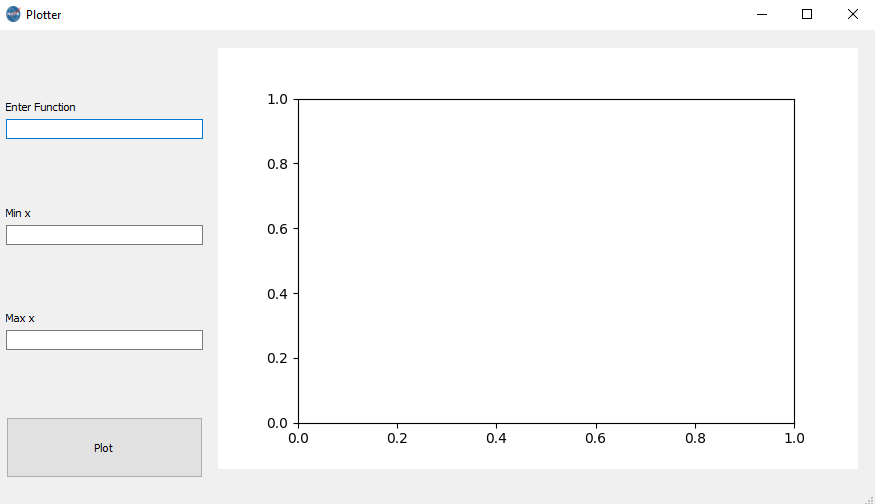
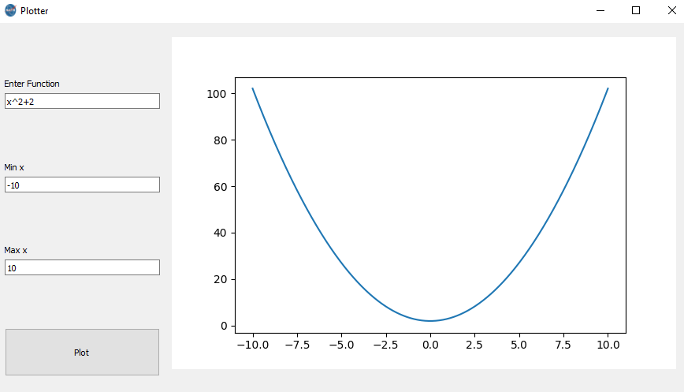
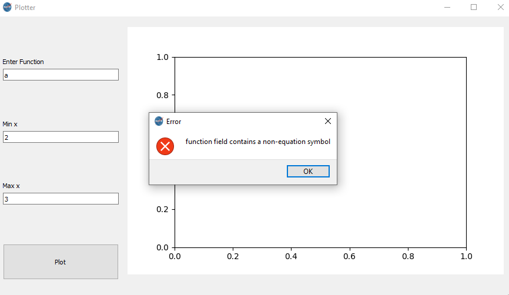
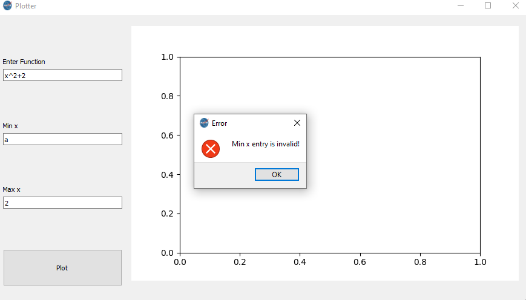
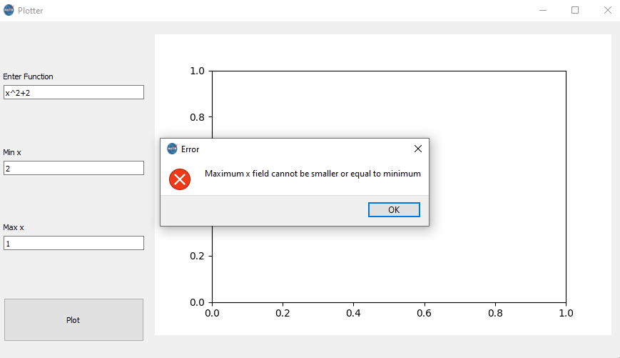
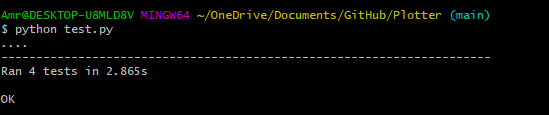

# Plotter
 simple GUI to plot equation inputed by the user.
 
---
## samples
### GUI:

---
### Happy scenario:

---
### Function field error:

---
### Min field error:

---
### Min > Max:

---
### testing:

---
